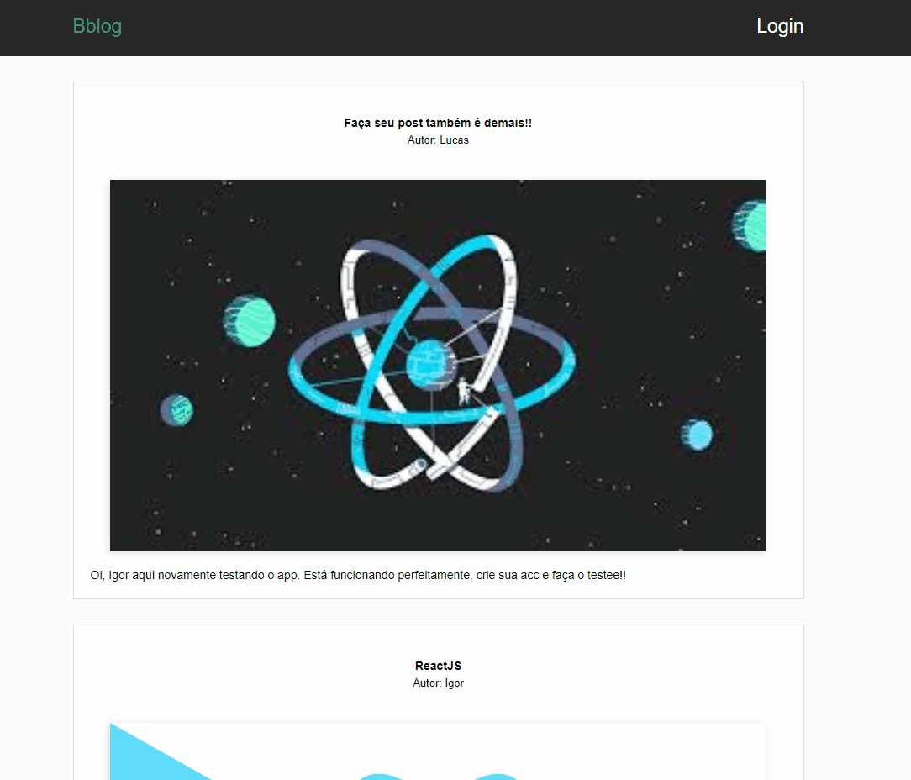

<h1 align="center">
    BlogStage
    <br>
</h1>
<h4 align="center">
  Crie uma usuário e faça suas postagens, projeto desenvolvido com rotas, autenticações e firebase.    
</h4>
<h4 align="center">
  Create a user and make your posts, a project developed with routes, authentications and firebase. 
</h4>
<p align="center">
  <a href="#rocket-technologies">Technologies</a>&nbsp;&nbsp;&nbsp;|&nbsp;&nbsp;&nbsp;
  <a href="#information_source-how-to-use">How To Use</a>&nbsp;&nbsp;&nbsp;|&nbsp;&nbsp;&nbsp;
  <a href="#memo-license">License</a>
</p>

<p align="center">
  
</p>
<br/>
<p align="center">
  
</p>

## :rocket: Technologies

This project was developed with the following technologies:

- [React JS](https://pt-br.reactjs.org/)
- [Firebase](https://firebase.google.com/)

## :information_source: How To Use

To clone and run this application, you'll need [Git](https://git-scm.com), [Node.js v10.16][nodejs]. From your command line:

```bash
# Clone this repository
$ git clone https://github.com/IgorMarchi/blog-post Blog
# Go into the repository
$ cd Blog
# Install dependencies
$ npm install
# Run project
$ npm start
```

## :memo: License

This project is under the MIT license. See the [LICENSE](https://github.com/IgorMarchi/blog-post/blob/master/LICENSE) for more information.

Made with ❤ [Igor Marchi](https://www.linkedin.com/in/igor-marchi/) :laughing:
